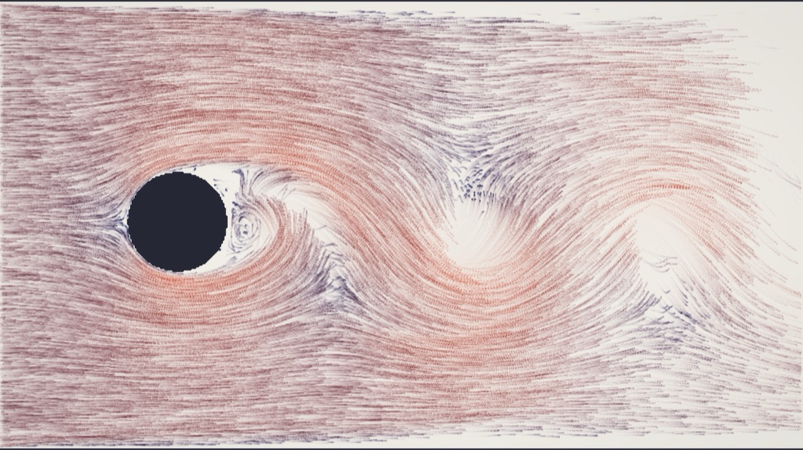
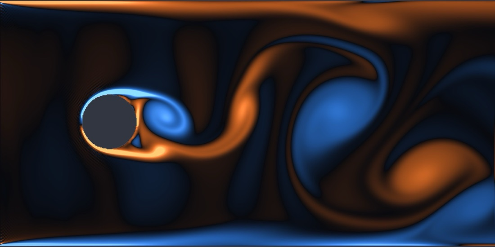
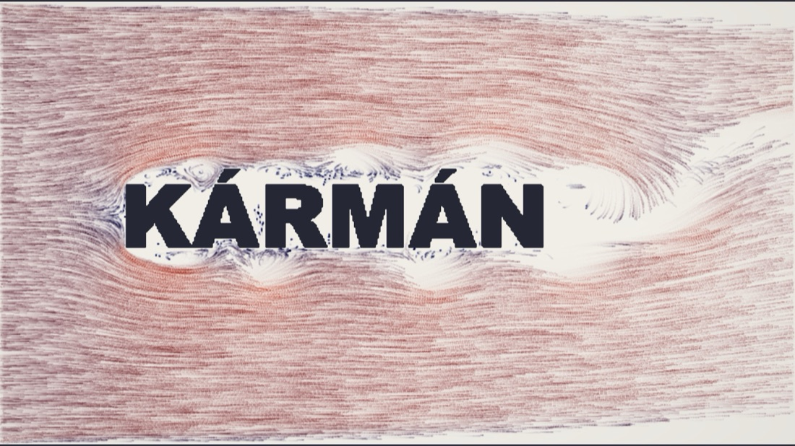

<div align="center">

# kármán

**A real-time fluid simulator that runs on your GPU, in a browser tab.**

WebGL2 fragment shaders solve the Navier–Stokes equations ten times per frame.
Drag your mouse through the fluid, or put your own name in the wind tunnel.

### [▶ &nbsp;Try it live](https://kratik1.github.io/karman/)



*16,384 GPU tracer particles riding the flow around a cylinder. The recirculation bubble, the spiral vortex cores, and the alternating vortex street all emerge from the physics. Nothing here is scripted or pre-rendered.*

</div>

---

## Run it locally

The whole app is a static page: `index.html` plus about a thousand lines of JS and GLSL. There is no build step.

```bash
git clone https://github.com/kratik1/karman && cd karman
npx http-server          # or any static file server
# open the printed localhost URL
```

> Requires WebGL2 with float render targets (`EXT_color_buffer_float`). Every current desktop browser has this, and most mobile ones do too.

## The tour

<table>
<tr>
<td></td>
<td></td>
</tr>
<tr>
<td align="center"><i>Vorticity: blue spins clockwise, orange counter-clockwise</i></td>
<td align="center"><i>The "Your text" preset. Type anything; it becomes the obstacle.</i></td>
</tr>
</table>

| | |
|---|---|
| **Drag** | Stir the fluid: inject momentum and dye |
| **Shift-drag** | Draw a solid obstacle and the flow re-forms around it |
| **Right-drag** | Erase obstacles |
| `1` `2` `3` `4` | Field: dye · vorticity · speed · **tracers** |
| `[` `]` | Brush size (a ring shows you) |
| `Space` `R` `C` `H` | Pause · reset flow · clear obstacles · hide UI |

Presets: a cylinder (the classic vortex-street generator), a NACA 0012 airfoil at angle of attack, a slalom of pillars, your own text, and an empty sandbox. The viscosity slider sweeps the Reynolds number live. Turn it down and the wake goes from a tidy laminar street to a churning turbulent one.

You also get a console API for tinkering: `karman.warp(600)` fast-forwards 600 frames synchronously (this is how the screenshots in this README were taken), and `karman.sim` hands you the live simulation object.

## How it works

This is the **Lattice-Boltzmann Method (LBM)**. Instead of discretising the Navier–Stokes equations, LBM simulates a fictitious gas of particle *populations* streaming and colliding on a regular lattice. In the limit of small Mach number, the macroscopic behaviour of this toy gas provably *is* incompressible Navier–Stokes (via the Chapman–Enskog expansion). Every cell update touches only its nearest neighbours, so the algorithm maps onto a GPU with no compromises.

**The D2Q9 lattice.** Each cell holds nine numbers `fᵢ`: the density of particles moving along nine discrete directions (rest, 4 axial, 4 diagonal):

```
  6   2   5
    ╲ │ ╱
  3 ─ 0 ─ 1
    ╱ │ ╲
  7   4   8
```

Density and velocity are moments of these populations:

```
ρ  = Σ fᵢ
ρu = Σ fᵢ eᵢ
```

**Each timestep is two operations:**

1. **Collide.** Relax every population toward its local Maxwell–Boltzmann equilibrium with a single relaxation time τ (the BGK approximation):
   ```
   fᵢ ← fᵢ + (1/τ)(fᵢᵉ𐞥 − fᵢ),   fᵢᵉ𐞥 = wᵢ ρ [1 + 3(eᵢ·u) + 4.5(eᵢ·u)² − 1.5 u·u]
   ```
2. **Stream.** Every population hops to the neighbouring cell in its direction.

The kinematic viscosity falls straight out of the relaxation time:

```
ν = cₛ² (τ − ½),   cₛ² = 1/3
```

The viscosity slider in the UI sets τ, and the HUD computes `Re = U·L/ν` from it.

**Boundaries.** Solid walls and obstacles use half-way bounce-back: a population that would stream into a solid cell reflects back the way it came, which enforces no-slip to second-order accuracy. The inlet holds a fixed velocity (after Zou & He); the outlet copies its upstream neighbour.

### On the GPU

The entire state lives in floating-point textures. The nine populations pack into three `RGBA32F` textures, and one collide-and-stream pass per substep ping-pongs between two such triplets using multiple render targets. Streaming happens in gather form, where each cell pulls from its neighbours, so there is no separate streaming pass and no race condition.

The visual layers are passengers on the velocity field:

- **Dye**: a scalar field advected semi-Lagrangianly, injected as streaklines at the inlet.
- **Tracers**: 16,384 particles whose positions live in a texture. A fragment shader advects them; they splat as additive points into a trail buffer that decays each frame. This is the digital version of smoke-wire flow visualization. Rendering uses `gl_VertexID` alone, with zero vertex buffers.
- **Vorticity**: the curl of velocity, computed by finite differences in the display shader.

At the default grid this works out to roughly 10⁷ lattice-site updates per frame at 60 fps. The HUD reports the achieved MLUPS (mega-lattice-updates per second).

## Why it looks the way it does

Above a critical Reynolds number (about 47 for a cylinder) the steady wake becomes unstable, and the smallest asymmetry grows into the self-sustaining, alternating shedding you see. The simulation seeds a whisper of asymmetry at startup so you don't wait for numerical noise to break the symmetry. After that the equations take over.

## Project layout

```
index.html                page shell + control panel
src/
  gl.js                   WebGL2 helpers: shaders, float textures, MRT framebuffers
  lbm.js                  simulation state + per-frame pass orchestration
  render.js               dye advection + final compositing
  particles.js            GPU tracer particles + fading trail buffer
  presets.js              obstacle masks (cylinder, NACA airfoil, pillars, text)
  main.js                 app loop, pointer input, UI
  shaders/
    common.glsl.js        D2Q9 lattice constants + equilibrium
    sim.glsl.js           init / BGK collision / streaming + boundaries
    render.glsl.js        dye advection + colormaps (vorticity, speed, dye, trails)
    particles.glsl.js     particle advection + point splatting + trail decay
```

## References

- T. Krüger et al., *The Lattice Boltzmann Method: Principles and Practice* (Springer, 2017). The standard modern reference.
- Q. Zou & X. He, "On pressure and velocity boundary conditions for the lattice Boltzmann BGK model," *Phys. Fluids* **9**, 1591 (1997). The inlet/outlet boundary conditions.
- P. Bhatnagar, E. Gross, M. Krook, "A model for collision processes in gases," *Phys. Rev.* **94**, 511 (1954). The BGK collision operator.
- M. Van Dyke, *An Album of Fluid Motion* (1982). The book the tracer mode is trying to look like.

## License

MIT. Do whatever you like with it.
